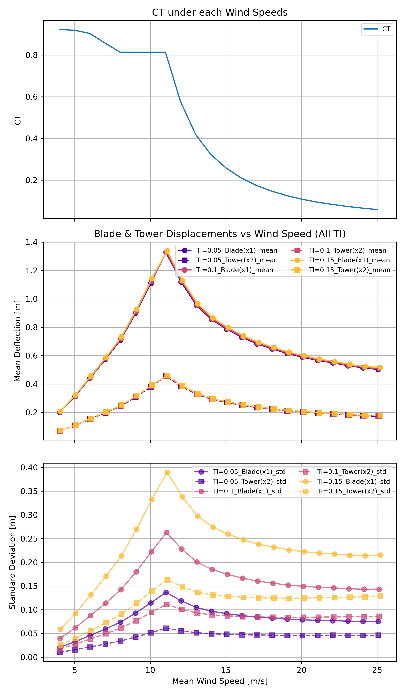

# Project02_46W38
The project 02 for 46W38, which for doing the turbine simulation.

## Discussion of Results

Turbie was simulated under multiple wind speeds and turbulence intensities (TI) using the provided wind time series.  
For each case, the blade and tower displacements were computed by integrating the 2DOF mass–spring–damper system.  
Mean and standard deviation values were obtained after removing the initial transient period (first 60 s).  
  
### Results  
The results show mean deflections of both the blades and tower increase with wind speed between 4-11 m/s and decrease between 11-25 m/s.  
The mean deflections remain similar across different turbulence intensities (TI), indicating that TI has little effect on the average structural displacement.  
In contrast, the standard deviation increases significantly with higher TI values, showing a wider range of instantaneous motion under more turbulent conditions.  
This suggests that turbulence mainly influences short-term fluctuations in deflection, while the mean displacement is governed primarily by the steady aerodynamic load associated with the mean wind speed.  
  
### Discussion  
When checking the relation between CT and the displacement results above 11 m/s, the same pattern is observed — the displacement is proportional to the CT value. This indicates that the rated wind speed of the turbine is around 11 m/s.
Beyond this point, the turbine begins shedding aerodynamic loads at rated power by adjusting the blade pitch angle, which is part of the power-limiting control strategy. 
   
Looking at the CT table, the CT value remains nearly constant between 8 m/s and 11 m/s. This corresponds to the transition region, where the control system gradually switches from torque control to pitch control.  
The smooth transition helps avoid power spikes, torque oscillations, or abrupt pitch changes that could stress the drivetrain.  
  
Between 4 m/s and 8 m/s, the turbine operates with a high thrust coefficient, extracting as much energy as possible from the wind — this is the power-optimization region.




## Main Simulation Workflow (main.py)

The `main.py` script performs the following operations for each wind speed and turbulence intensity (TI) case:

```python
# 1. Load turbine parameters and CT table
turbine_params, _ = turbie.load_turbine_prop("inputs/turbie_inputs/turbie_parameters.txt")
CT_table = turbie.load_CT("inputs/turbie_inputs/CT.txt")

# 2. Build system matrices and plot CT-V table
Plot(CT-V)
M, C, K = turbie.build_sys_matrices(turbine_params)

# 3. For each TI folder and wind speed case:
for txt_file in wind_files:
    df = turbie.load_WSdata(txt_file)
    u_func, t_vec, u_vec = turbie.build_ws_func(df)
    rho_ct_a = turbie.rho_CT_A(df, turbine_params, CT_table)

    # 4. Solve Turbie ODE system using scipy.integrate.solve_ivp
    sol = solve_ivp(
        turbie.ydot, [t_vec[0], t_vec[-1]], y0=np.zeros(4),
        t_eval=t_vec, args=(M, C, K, u_func, rho_ct_a)
    )

    # 5. Save deflection time series and compute statistics
    np.savetxt("outputs/.../response_*.txt", ...)
    mean_x1, std_x1 = np.mean(x1), np.std(x1)
    mean_x2, std_x2 = np.mean(x2), np.std(x2)

# 6. Generate summary and plots
turbie.plot_each_TI(...)
turbie.plot_all_TI(...)
```

## Code Structure  

Project02_46W38/  
├── main.py                     # Main script for simulation, result export, and plotting  
├── turbie_mod.py               # Module defining equations, functions, and helper utilities  
├── inputs/  
│   ├── turbie_inputs/  
│   │   ├── CT.txt              # C_T vs mean wind speed table  
│   │   └── turbie_parameters.txt   # Physical parameters (masses, damping, stiffness, etc.)  
│   └── wind_files/  
│       ├── TI_0.10/  
│       │   ├── wind_6_ms_TI_0.10.txt  
│       │   ├── wind_8_ms_TI_0.10.txt  
│       │   └── ...  
│       ├── TI_0.15/  
│       └── TI_0.20/  
└── outputs/  
    ├── TI_0.10/  
    ├── TI_0.15/  
    ├── TI_0.20/  
    ├── Deflection_Plots/  
    └── Statistic_Plots/  

## Result Output Structure  

outputs/  
├── TI_0.10/  
│   ├── response_wind_6_ms_TI_0.10.txt  
│   ├── response_wind_8_ms_TI_0.10.txt  
│   ├── Statistic_summary.txt  
│   └── ...  
├── TI_0.15/  
│   ├── response_wind_*_ms_TI_0.15.txt  
│   ├── Statistic_summary.txt  
│   └── ...  
├── Statistic_summary_all.txt
├── CT-V.png  
├── Deflection_Plots/  
│   ├── Deflection_wind_6_ms_TI_0.10.png  
│   ├── ...  
└── Statistic_Plots/  
    ├── Mean_vs_WS_TI_0.10.png  
    ├── Std_vs_WS_TI_0.15.png  
│   ├── ...  
    └── All_TI_Comparison.png  
